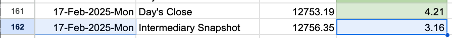
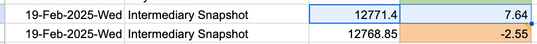

# UseCases to Be Implemented

### Save Balance Snapshot

#### Description/Context
When you Paste a new Balance SnapShot,
Aplicatia completeaza automat Data, si implicit intoarce un Diff cu ultimul Balance(Day's Close?!)
Astfel ca dintr-o miscare eu stiu cat am progresat fata de ultima data
- 
- But, if you only see the DIFF: `+3.16` probably it makes much more sense to also show the 
Previous SnapShot, for Context. For instance here where we have Negative SnapShot
  - 

1. -[ ] Capture Current Balance EndPoint
   - [ ] Call EndPoint From FrondEnd 

